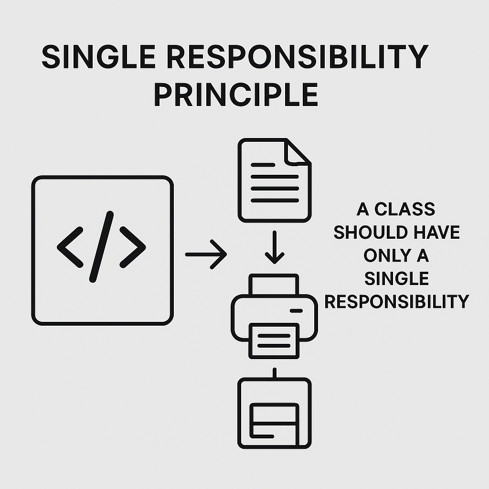
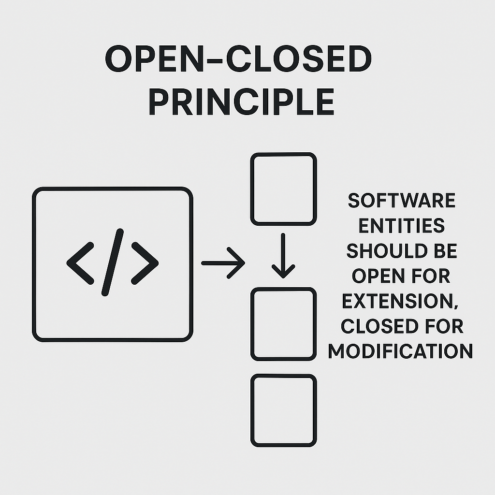
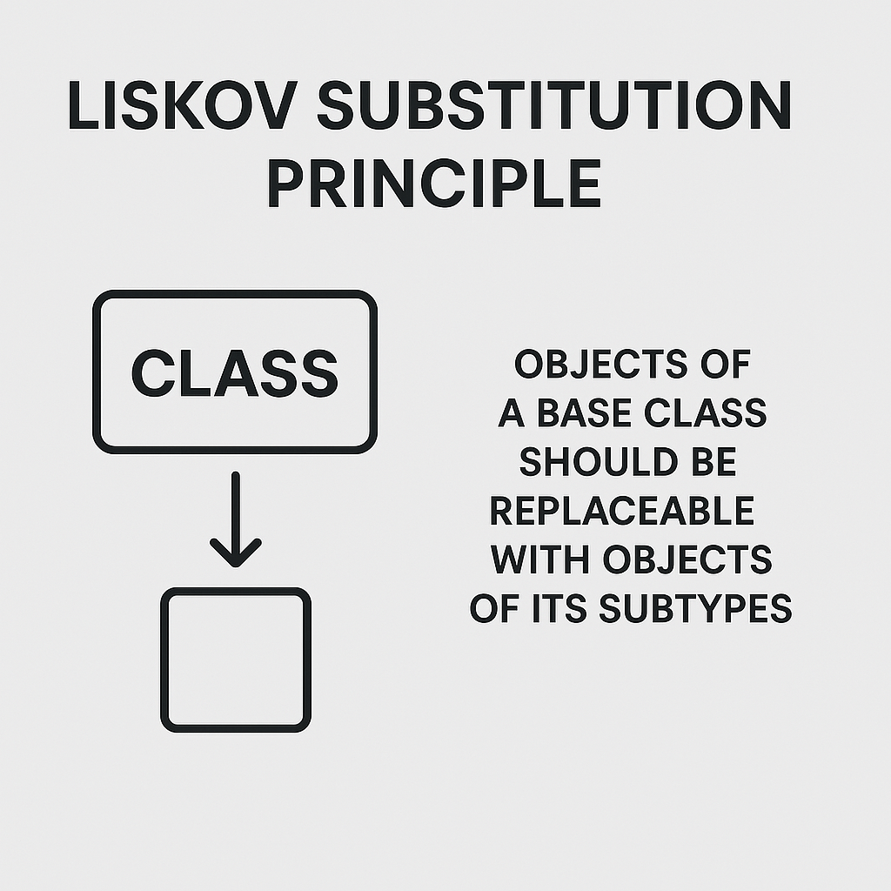
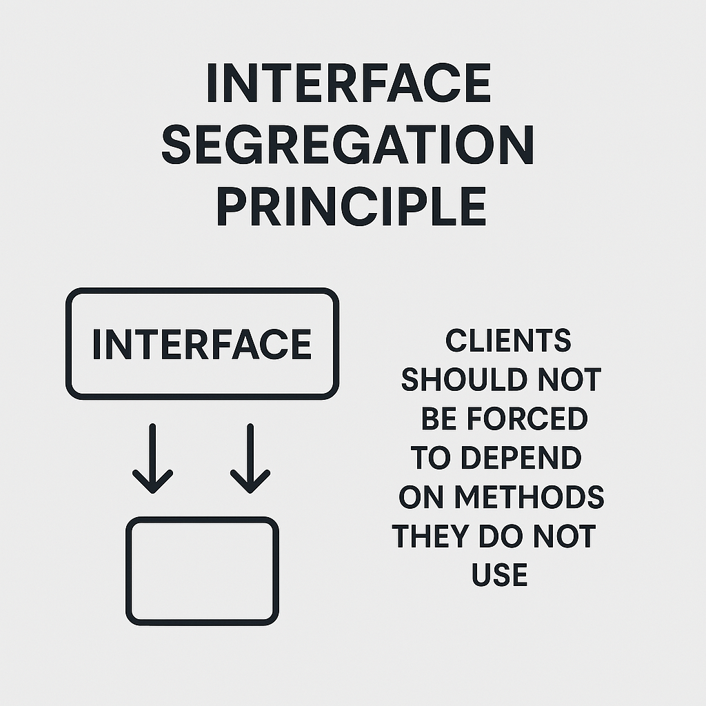
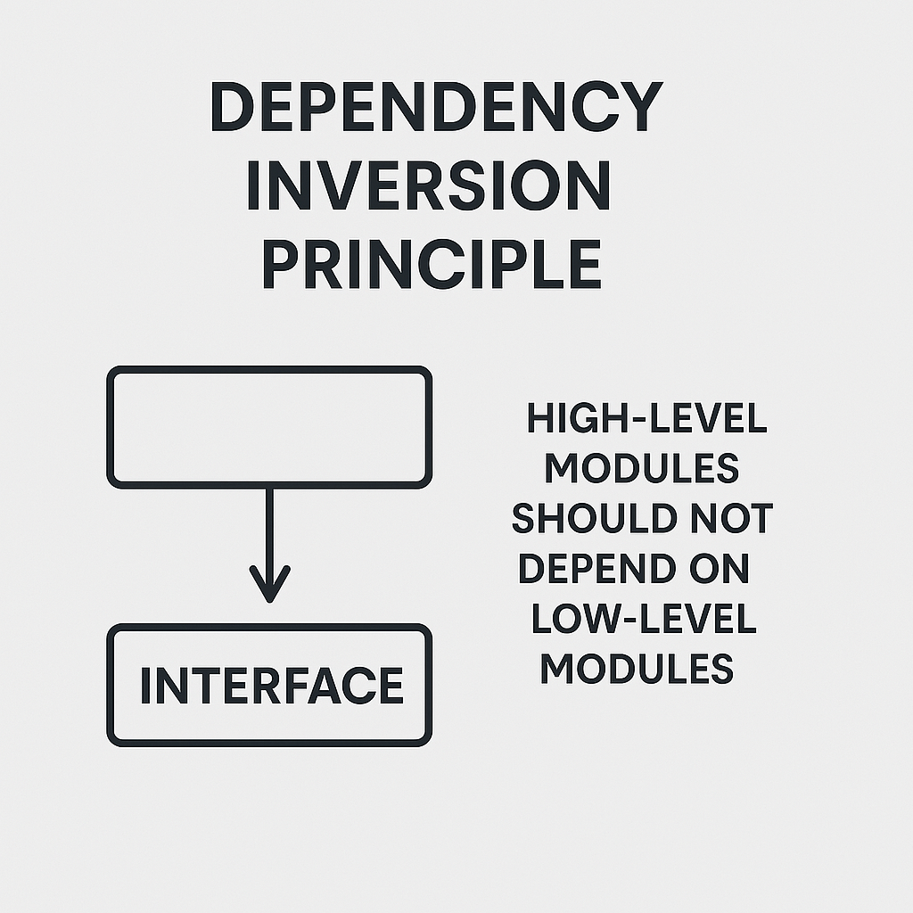

# SOLID Principles: Professional Summary and Practical Applications

## Table of Contents
1. [Introduction](#introduction)
2. [Professional Summary](#professional-summary)
3. [Visual Application: Diagrams](#visual-application-diagrams)
4. [SOLID Principles Summary](#solid-principles-summary)
    1. [Single Responsibility Principle (SRP)](#1-single-responsibility-principle-srp)
    2. [Open/Closed Principle (OCP)](#2-openclosed-principle-ocp)
    3. [Liskov Substitution Principle (LSP)](#3-liskov-substitution-principle-lsp)
    4. [Interface Segregation Principle (ISP)](#4-interface-segregation-principle-isp)
    5. [Dependency Inversion Principle (DIP)](#5-dependency-inversion-principle-dip)
5. [Professional Relevance](#professional-relevance)
6. [Conclusion](#conclusion)

---

## Introduction
The SOLID principles are five key rules in object-oriented design that help you create scalable, maintainable, and robust software. These were promoted by Robert C. Martin (Uncle Bob), and the acronym was coined by Michael Feathers.

---

## Professional Summary

| Principle | Objective | Key Benefit |
|----------|----------|------------------|
| SRP - Single Responsibility | A class should only have one reason to change. | Cohesive and easily maintainable classes |
| OCP - Open/Closed | Code should be open for extension but closed for modification. | Fewer bugs when extending functionality |
| LSP - Liskov Substitution | Subclasses should replace base classes without unexpected behavior. | Reliable inheritance and safe polymorphism |
| ISP - Interface Segregation | Many small interfaces are better than a general-purpose one. | Flexible, reusable modules |
| DIP - Dependency Inversion | Depend on abstractions, not concrete classes. | Low coupling and high flexibility |

---

## Visual Application: Diagrams

1. **Invoice Diagram (SRP and OCP)**:
   - Business logic (Invoice), printing (InvoicePrint), and persistence (InvoicePersistence) are separated.
   - Interface use enables extensibility (save to file, database, etc.).

2. **Parking Diagram (ISP)**:
   - Separate interfaces for different parking types.
   - FreeParking is not forced to implement payment logic.

---

## SOLID Principles Summary

### 1. Single Responsibility Principle (SRP)



- A class should have only one reason to change.

**Before Refactor**:
```csharp
public class CEmployee {
    private string name;
    private string position;
    private int age;
    private double salary;

    public CEmployee(string name, string position, int age, double salary) {
        this.name = name;
        this.position = position;
        this.age = age;
        this.salary = salary;
    }

    public override string ToString() {
        return $"Name: {name}, Position: {position}, Age: {age}, Salary: {salary}";
    }

    public double CI(){
        return salary * 0.1; // 10% commission
    }

    public void PI(){
        double imp = CI();
        Console.WriteLine($"Pay {imp} in {name}");
    }
}
```
This class violates SRP by handling:
- Employee data
- Commission calculation
- Payment display

**After Refactor**:
```csharp
public class CEmployee {
    public string Name { get; set; }
    public double Salary { get; set; }
    public CEmployee(string name, string position, int age, double salary) {
        Name = name;
        Salary = salary;
        // other fields omitted for SRP
    }
    public override string ToString() {
        return $"Name: {Name}, Salary: {Salary}";
    }
}

public static class CTaxesDepartment {
    public static double CI(CEmployee employee) {
        return employee.Salary * 0.1;
    }

    public static void PI(CEmployee employee) {
        double imp = CI(employee);
        Console.WriteLine($"Pay {imp} in {employee.Name}");
    }
}
```
This separation ensures each class has only one responsibility:
- `CEmployee`: holds data
- `CTaxesDepartment`: manages tax logic


### 2. Open/Closed Principle (OCP)



- Open for extension, closed for modification.

**Before Refactor**:
```csharp
public class CStore {
    private List<CProduct> products = new List<CProduct>();

    public CStore(List<CProduct> pProducts) {
        this.products = pProducts;
    }

    public void CI(){
        double total = 0;
        foreach (CProduct cProduct in products){
            Console.WriteLine(cProduct);
            total += cProduct.Price;
        }

        // Discount logic by category
        foreach(CProduct cProduct in products){
            if (cProduct.Category == 1){
                total += cProduct.Price * 0.9; // 10% discount
            } else if (cProduct.Category == 2){
                total += cProduct.Price * 0.8; // 20% discount
            }
        }
    }
}
```
This implementation violates OCP since new categories require modifying the `CI` method directly.

**After Refactor**:
```csharp
abstract class CBaseInventory {
    protected CProduct product;

    public CProduct Product {
        get { return product; }
        set { product = value; }
    }

    public CBaseInventory(CProduct product) {
        this.product = product;
    }

    public abstract double GetPrice();
}

class CAlimentInventory : CBaseInventory {
    public CAlimentInventory(CProduct product) : base(product) {}
    public override double GetPrice() {
        product.Price *= 1.2; // 20% markup
        return product.Price;
    }
}

class CMedicamentInventory : CBaseInventory {
    public CMedicamentInventory(CProduct product) : base(product) {}
    public override double GetPrice() {
        product.Price *= 0.8; // 20% discount
        return product.Price;
    }
}

class CStore {
    private List<CBaseInventory> products;

    public CStore(List<CBaseInventory> pProducts) {
        products = pProducts;
    }

    public void CI() {
        double total = 0;
        foreach (CBaseInventory product in products) {
            product.GetPrice();
            Console.WriteLine(product);
            total += product.Product.Price;
        }
        Console.WriteLine("Total is {0}", total);
    }
}
```
This refactor applies the Strategy Pattern and follows the Open/Closed Principle:
- New categories can be added via subclasses of `CBaseInventory`.
- Existing logic is untouched.

### 3. Liskov Substitution Principle (LSP)




- Subclasses must behave like their base classes.

**Before Refactor**:
```csharp
class News {
    protected string name;

    public News(string name) {
        this.name = name;
    }

    public virtual void Show() {
        Console.WriteLine($"News: {name}");
    }
}

class Radio : News {
    public Radio(string name) : base(name) {}

    public override void Show() {
        Console.WriteLine($"Radio: {name}");
    }
}

class Program {
    static void Main(string[] args) {
        News news = new News("New");
        news.Show();

        Radio radio = new Radio("Radio");
        radio.Show();

        News substitutedNews = new Radio("Substituted Radio");
        substitutedNews.Show();
    }
}
```
This code technically follows LSP in the sense that a `Radio` object can substitute a `News` object, but it lacks the structural constraints that ensure consistent behavior across multiple subclasses.

**After Refactor**:
```csharp
abstract class PrincipalBase {
    protected string message;
    public PrincipalBase(string pMessage) {
        message = pMessage;
    }
    public abstract void Show();
}

abstract class PrincipalWithOtherMethod : PrincipalBase {
    public PrincipalWithOtherMethod(string pMessage): base(pMessage) {}
    public abstract void OtherMethod();
}

class New : PrincipalBase {
    public New(string pMessage): base(pMessage) {}

    public override void Show() {
        Console.WriteLine("From new : {0}", message);
    }
}

class Radio : PrincipalWithOtherMethod {
    public Radio(string pMessage) : base(pMessage) {}

    public override void Show() {
        Console.WriteLine("From radio: {0}", message);
    }

    public override void OtherMethod() {
        Console.WriteLine("From radio implement other method");
    }
}

class Program {
    static void Main(string[] args) {
        PrincipalBase newObj = new New("New");
        newObj.Show();

        PrincipalWithOtherMethod radioObj = new Radio("Radio");
        radioObj.Show();
        radioObj.OtherMethod();
    }
}
```
This design enforces LSP by using abstract base classes (`PrincipalBase` and `PrincipalWithOtherMethod`) with clearly defined behaviors:
- Each subclass must implement the required methods.
- Ensures predictable substitution and consistent interface usage.

### 4. Interface Segregation Principle (ISP)



- Interfaces should be small and specific.

**Before Refactor**:
```csharp
interface IMultifunctional {
    void Print();
    void Scanner();
    void Telephone();
    void Fax();
}

class OfficeFax : IMultifunctional {
    public void Fax() {
        Console.WriteLine("Fax");
    }

    public void Print() {
        throw new NotImplementedException();
    }

    public void Scanner() {
        throw new NotImplementedException();
    }

    public void Telephone() {
        Console.WriteLine("Telephone");
    }
}

class MultiSingle : IMultifunctional {
    public void Fax() {
        throw new NotImplementedException();
    }

    public void Print() {
        Console.WriteLine("Print");
    }

    public void Scanner() {
        Console.WriteLine("Scanner");
    }

    public void Telephone() {
        throw new NotImplementedException();
    }
}
```
This design violates ISP by forcing classes to implement methods they don't support.

**After Refactor**:
```csharp
interface IMultifunctionalBasic {
    void Print();
    void Scanner();
}

interface IFax {
    void Telephone();
    void Fax();
}

interface IMultifunctional : IFax, IMultifunctionalBasic {}

class OfficeFax : IFax {
    public void Fax() {
        Console.WriteLine("Fax");
    }
    public void Telephone() {
        Console.WriteLine("Telephone");
    }
}

class MultiAdvanced : IMultifunctional {
    public void Fax() {
        Console.WriteLine("Fax");
    }
    public void Print() {
        Console.WriteLine("Print");
    }
    public void Scanner() {
        Console.WriteLine("Scanner");
    }
    public void Telephone() {
        Console.WriteLine("Telephone");
    }
}

class MultiAdvancedBasic : IMultifunctionalBasic {
    public void Print() {
        Console.WriteLine("Print");
    }
    public void Scanner() {
        Console.WriteLine("Scanner");
    }
}
```
This solution aligns with the Interface Segregation Principle:
- Clients implement only the functionality they support.
- Reduces need for throwing `NotImplementedException()`.

### 5. Dependency Inversion Principle (DIP)



- Depend on abstractions, not on concrete implementations.

**Before Refactor**:
```csharp
class Store {
    private List<Product> inventory = new List<Product>();
    public List<Product> Inventory {
        get => inventory;
        set => inventory = value;
    }

    public void AddProduct(Product pProduct) {
        inventory.Add(pProduct);
        Console.WriteLine("Add {0}", pProduct.Nombre);
    }
}

class Auditor {
    private Store myStore;
    public Auditor(Store pStore) {
        myStore = pStore;
    }

    public double totalAliments() {
        double total = 0;
        foreach (Product p in myStore.Inventory) {
            if (p.Tipo == 0) {
                Console.WriteLine(p);
                total += p.Price;
            }
        }
        return total;
    }
}
```
This implementation tightly couples `Auditor` to `Store`, violating the DIP.

**After Refactor**:
```csharp
interface IAuditable {
    IEnumerable<Product> GetProducts(int pTipo);
}

class Store : IAuditable {
    private List<Product> inventory = new List<Product>();

    public void AddProduct(Product pProduct) {
        inventory.Add(pProduct);
        Console.WriteLine("Add {0}", pProduct.Nombre);
    }

    public IEnumerable<Product> GetProducts(int pTipo) {
        return inventory.Where(p => p.Tipo == pTipo);
    }
}

class Auditor {
    private IAuditable store;
    public Auditor(IAuditable pStore) {
        store = pStore;
    }

    public double totalAliments() {
        double total = 0;
        IEnumerable<Product> list = store.GetProducts(0);
        foreach (Product p in list) {
            Console.WriteLine(p);
            total += p.Price;
        }
        return total;
    }
}
```
This refactor applies DIP by introducing the `IAuditable` abstraction:
- `Auditor` depends only on the interface, not on the concrete class.
- Increases flexibility and testability.

---

## Professional Relevance
- **Code Quality**: Cleaner, more readable, and maintainable.
- **Scalability**: Easier to add new features.
- **Team Collaboration**: Fewer merge conflicts, clear class/module ownership.
- **Testing**: Easier to test decoupled, cohesive classes.

---

## Conclusion
Applying SOLID leads to highly cohesive, loosely coupled, and change-resilient software. Learning these principles is essential for any professional object-oriented developer.

> "Design is the way we structure code so that change becomes a safe and simple operation."

